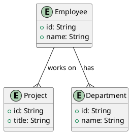

To create a Spring Boot project with MongoDB, build it, and implement CRUD APIs for an `Employee` entity with one-to-many, many-to-one, and many-to-many relationships, follow these steps:

### 1. Project Setup - (MongoDb)

#### `pom.xml` Configuration

Your `pom.xml` file is already configured for a Spring Boot project with MongoDB. Here's a summary of the essential parts:

```xml
<project xmlns="http://maven.apache.org/POM/4.0.0" xmlns:xsi="http://www.w3.org/2001/XMLSchema-instance"
	xsi:schemaLocation="http://maven.apache.org/POM/4.0.0 https://maven.apache.org/xsd/maven-4.0.0.xsd">
	<modelVersion>4.0.0</modelVersion>
	<parent>
		<groupId>org.springframework.boot</groupId>
		<artifactId>spring-boot-starter-parent</artifactId>
		<version>3.3.2</version>
		<relativePath/> <!-- lookup parent from repository -->
	</parent>
	<groupId>com.example</groupId>
	<artifactId>employee-management-service</artifactId>
	<version>0.0.1-SNAPSHOT</version>
	<name>employee-management-service</name>
	<description>Employee Management API using Spring Boot and MongoDB</description>
	<properties>
		<java.version>17</java.version>
	</properties>
	<dependencies>
		<!-- Spring Boot Dependencies -->
		<dependency>
			<groupId>org.springframework.boot</groupId>
			<artifactId>spring-boot-starter-web</artifactId>
		</dependency>
		<!-- MongoDB Dependency -->
		<dependency>
			<groupId>org.springframework.boot</groupId>
			<artifactId>spring-boot-starter-data-mongodb</artifactId>
		</dependency>
		<!-- Lombok Dependency -->
		<dependency>
			<groupId>org.projectlombok</groupId>
			<artifactId>lombok</artifactId>
			<version>1.18.20</version>
			<scope>provided</scope>
		</dependency>
		<!-- Validation Dependency -->
		<dependency>
			<groupId>org.springframework.boot</groupId>
			<artifactId>spring-boot-starter-validation</artifactId>
		</dependency>
		<!-- DevTools Dependency -->
		<dependency>
			<groupId>org.springframework.boot</groupId>
			<artifactId>spring-boot-devtools</artifactId>
			<scope>runtime</scope>
			<optional>true</optional>
		</dependency>
		<!-- Testing Dependencies -->
		<dependency>
			<groupId>org.springframework.boot</groupId>
			<artifactId>spring-boot-starter-test</artifactId>
			<scope>test</scope>
		</dependency>
	</dependencies>
	<build>
		<plugins>
			<plugin>
				<groupId>org.springframework.boot</groupId>
				<artifactId>spring-boot-maven-plugin</artifactId>
			</plugin>
		</plugins>
	</build>
</project>
```

#### `application.yml` Configuration

Here's the configuration for MongoDB and logging:

```yaml
server:
  port: 8080

spring:
  data:
    mongodb:
      url: mongodb://localhost:27017/employeedb

logging:
  level:
    root: INFO
    org.springframework.web: DEBUG
    com.example: DEBUG
```

### 2. Create CRUD API with Java 8

Let’s define the `Employee`, `Department`, and `Project` entities and their relationships.

#### Entity Classes

##### Employee.java

```java
package com.example.employeemanagementservice.model;

import lombok.Data;
import org.springframework.data.annotation.Id;
import org.springframework.data.mongodb.core.mapping.Document;
import org.springframework.data.mongodb.core.mapping.DBRef;

import java.util.List;

@Data
@Document(collection = "employees")
public class Employee {
    @Id
    private String id;
    private String name;
    
    @DBRef
    private Department department;
    
    @DBRef
    private List<Project> projects;
}
```

##### Department.java

```java
package com.example.employeemanagementservice.model;

import lombok.Data;
import org.springframework.data.annotation.Id;
import org.springframework.data.mongodb.core.mapping.Document;

@Data
@Document(collection = "departments")
public class Department {
    @Id
    private String id;
    private String name;
}
```

##### Project.java

```java
package com.example.employeemanagementservice.model;

import lombok.Data;
import org.springframework.data.annotation.Id;
import org.springframework.data.mongodb.core.mapping.Document;

@Data
@Document(collection = "projects")
public class Project {
    @Id
    private String id;
    private String title;
}
```

#### Repository Interfaces

##### EmployeeRepository.java

```java
package com.example.employeemanagementservice.repository;

import com.example.employeemanagementservice.model.Employee;
import org.springframework.data.mongodb.repository.MongoRepository;

public interface EmployeeRepository extends MongoRepository<Employee, String> {
}
```

##### DepartmentRepository.java

```java
package com.example.employeemanagementservice.repository;

import com.example.employeemanagementservice.model.Department;
import org.springframework.data.mongodb.repository.MongoRepository;

public interface DepartmentRepository extends MongoRepository<Department, String> {
}
```

##### ProjectRepository.java

```java
package com.example.employeemanagementservice.repository;

import com.example.employeemanagementservice.model.Project;
import org.springframework.data.mongodb.repository.MongoRepository;

public interface ProjectRepository extends MongoRepository<Project, String> {
}
```

#### Service Classes

##### EmployeeService.java

```java
package com.example.employeemanagementservice.service;

import com.example.employeemanagementservice.model.Employee;
import com.example.employeemanagementservice.repository.EmployeeRepository;
import org.springframework.beans.factory.annotation.Autowired;
import org.springframework.stereotype.Service;

import java.util.List;
import java.util.Optional;

@Service
public class EmployeeService {
    @Autowired
    private EmployeeRepository employeeRepository;

    public Employee saveEmployee(Employee employee) {
        return employeeRepository.save(employee);
    }

    public List<Employee> getAllEmployees() {
        return employeeRepository.findAll();
    }

    public Optional<Employee> getEmployeeById(String id) {
        return employeeRepository.findById(id);
    }

    public void deleteEmployee(String id) {
        employeeRepository.deleteById(id);
    }
}
```

##### DepartmentService.java

```java
package com.example.employeemanagementservice.service;

import com.example.employeemanagementservice.model.Department;
import com.example.employeemanagementservice.repository.DepartmentRepository;
import org.springframework.beans.factory.annotation.Autowired;
import org.springframework.stereotype.Service;

import java.util.List;
import java.util.Optional;

@Service
public class DepartmentService {
    @Autowired
    private DepartmentRepository departmentRepository;

    public Department saveDepartment(Department department) {
        return departmentRepository.save(department);
    }

    public List<Department> getAllDepartments() {
        return departmentRepository.findAll();
    }

    public Optional<Department> getDepartmentById(String id) {
        return departmentRepository.findById(id);
    }

    public void deleteDepartment(String id) {
        departmentRepository.deleteById(id);
    }
}
```

##### ProjectService.java

```java
package com.example.employeemanagementservice.service;

import com.example.employeemanagementservice.model.Project;
import com.example.employeemanagementservice.repository.ProjectRepository;
import org.springframework.beans.factory.annotation.Autowired;
import org.springframework.stereotype.Service;

import java.util.List;
import java.util.Optional;

@Service
public class ProjectService {
    @Autowired
    private ProjectRepository projectRepository;

    public Project saveProject(Project project) {
        return projectRepository.save(project);
    }

    public List<Project> getAllProjects() {
        return projectRepository.findAll();
    }

    public Optional<Project> getProjectById(String id) {
        return projectRepository.findById(id);
    }

    public void deleteProject(String id) {
        projectRepository.deleteById(id);
    }
}
```

#### Controller Classes

##### EmployeeController.java

```java
package com.example.employeemanagementservice.controller;

import com.example.employeemanagementservice.model.Employee;
import com.example.employeemanagementservice.service.EmployeeService;
import org.springframework.beans.factory.annotation.Autowired;
import org.springframework.http.HttpStatus;
import org.springframework.http.ResponseEntity;
import org.springframework.web.bind.annotation.*;

import java.util.List;
import java.util.Optional;

@RestController
@RequestMapping("/employees")
public class EmployeeController {
    @Autowired
    private EmployeeService employeeService;

    @PostMapping
    public ResponseEntity<Employee> createEmployee(@RequestBody Employee employee) {
        return new ResponseEntity<>(employeeService.saveEmployee(employee), HttpStatus.CREATED);
    }

    @GetMapping
    public ResponseEntity<List<Employee>> getAllEmployees() {
        return ResponseEntity.ok(employeeService.getAllEmployees());
    }

    @GetMapping("/{id}")
    public ResponseEntity<Optional<Employee>> getEmployeeById(@PathVariable String id) {
        return ResponseEntity.ok(employeeService.getEmployeeById(id));
    }

    @DeleteMapping("/{id}")
    public ResponseEntity<Void> deleteEmployee(@PathVariable String id) {
        employeeService.deleteEmployee(id);
        return ResponseEntity.noContent().build();
    }
}
```

##### DepartmentController.java

```java
package com.example.employeemanagementservice.controller;

import com.example.employeemanagementservice.model.Department;
import com.example.employe

emanagementservice.service.DepartmentService;
import org.springframework.beans.factory.annotation.Autowired;
import org.springframework.http.HttpStatus;
import org.springframework.http.ResponseEntity;
import org.springframework.web.bind.annotation.*;

import java.util.List;
import java.util.Optional;

@RestController
@RequestMapping("/departments")
public class DepartmentController {
    @Autowired
    private DepartmentService departmentService;

    @PostMapping
    public ResponseEntity<Department> createDepartment(@RequestBody Department department) {
        return new ResponseEntity<>(departmentService.saveDepartment(department), HttpStatus.CREATED);
    }

    @GetMapping
    public ResponseEntity<List<Department>> getAllDepartments() {
        return ResponseEntity.ok(departmentService.getAllDepartments());
    }

    @GetMapping("/{id}")
    public ResponseEntity<Optional<Department>> getDepartmentById(@PathVariable String id) {
        return ResponseEntity.ok(departmentService.getDepartmentById(id));
    }

    @DeleteMapping("/{id}")
    public ResponseEntity<Void> deleteDepartment(@PathVariable String id) {
        departmentService.deleteDepartment(id);
        return ResponseEntity.noContent().build();
    }
}
```

##### ProjectController.java

```java
package com.example.employeemanagementservice.controller;

import com.example.employeemanagementservice.model.Project;
import com.example.employeemanagementservice.service.ProjectService;
import org.springframework.beans.factory.annotation.Autowired;
import org.springframework.http.HttpStatus;
import org.springframework.http.ResponseEntity;
import org.springframework.web.bind.annotation.*;

import java.util.List;
import java.util.Optional;

@RestController
@RequestMapping("/projects")
public class ProjectController {
    @Autowired
    private ProjectService projectService;

    @PostMapping
    public ResponseEntity<Project> createProject(@RequestBody Project project) {
        return new ResponseEntity<>(projectService.saveProject(project), HttpStatus.CREATED);
    }

    @GetMapping
    public ResponseEntity<List<Project>> getAllProjects() {
        return ResponseEntity.ok(projectService.getAllProjects());
    }

    @GetMapping("/{id}")
    public ResponseEntity<Optional<Project>> getProjectById(@PathVariable String id) {
        return ResponseEntity.ok(projectService.getProjectById(id));
    }

    @DeleteMapping("/{id}")
    public ResponseEntity<Void> deleteProject(@PathVariable String id) {
        projectService.deleteProject(id);
        return ResponseEntity.noContent().build();
    }
}
```

### 3. Build and Run the Project

#### Build the Project

To build the project while skipping tests, use the following Maven command:

```sh
mvn clean install -DskipTests
```

#### Run the Project

To run the Spring Boot application, use the following command:

```sh
mvn spring-boot:run
```

This will start the application on port 8080 as configured in `application.yml`.

### Summary

You have set up a Spring Boot application with MongoDB, created entities with relationships, and implemented CRUD APIs for `Employee`, `Department`, and `Project`. You can build and run the project using Maven commands. If you need further customization or additional features, you can extend the existing classes and methods as required.

Below are the cURL commands to perform CRUD operations for the `EmployeeController`, `DepartmentController`, and `ProjectController` endpoints. These commands assume that your application is running locally on port `8080`.

### cURL Commands for `EmployeeController`

#### Create an Employee
```sh
curl -X POST http://localhost:8080/employees \
     -H "Content-Type: application/json" \
     -d '{
           "name": "John Doe",
           "department": {"id": "department_id_1"},
           "projects": [{"id": "project_id_1"}, {"id": "project_id_2"}]
         }'
```

#### Get All Employees
```sh
curl -X GET http://localhost:8080/employees
```

#### Get Employee by ID
```sh
curl -X GET http://localhost:8080/employees/{id}
```

#### Delete an Employee by ID
```sh
curl -X DELETE http://localhost:8080/employees/{id}
```

### cURL Commands for `DepartmentController`

#### Create a Department
```sh
curl -X POST http://localhost:8080/departments \
     -H "Content-Type: application/json" \
     -d '{
           "name": "Engineering"
         }'
```

#### Get All Departments
```sh
curl -X GET http://localhost:8080/departments
```

#### Get Department by ID
```sh
curl -X GET http://localhost:8080/departments/{id}
```

#### Delete a Department by ID
```sh
curl -X DELETE http://localhost:8080/departments/{id}
```

### cURL Commands for `ProjectController`

#### Create a Project
```sh
curl -X POST http://localhost:8080/projects \
     -H "Content-Type: application/json" \
     -d '{
           "title": "Project Alpha"
         }'
```

#### Get All Projects
```sh
curl -X GET http://localhost:8080/projects
```

#### Get Project by ID
```sh
curl -X GET http://localhost:8080/projects/{id}
```

#### Delete a Project by ID
```sh
curl -X DELETE http://localhost:8080/projects/{id}
```

### Notes

1. **Replace `{id}`** in the URL with the actual ID of the resource you want to access or delete.
2. **Replace `department_id_1`**, **`project_id_1`**, and **`project_id_2`** with actual IDs of existing departments and projects when creating an employee.
3. Ensure the `Content-Type` header is set to `application/json` for POST requests to indicate that the request body is JSON.

These cURL commands allow you to interact with your RESTful APIs and perform the necessary CRUD operations on `Employee`, `Department`, and `Project` resources.


### ERD Diagram using PlantUML

Here's the PlantUML code for the ERD diagram based on the provided classes (`Project`, `Department`, `Employee`):



### MongoDB Queries

#### Create Collections and Insert Documents

1. **Create Collection (Optional in MongoDB as collections are created implicitly when inserting documents)**

2. **Insert Documents**

```js
// Insert Departments
db.departments.insertMany([
    { _id: "dept1", name: "Engineering" },
    { _id: "dept2", name: "Marketing" },
    { _id: "dept3", name: "Finance" }
]);

// Insert Projects
db.projects.insertMany([
    { _id: "proj1", title: "Project Alpha" },
    { _id: "proj2", title: "Project Beta" },
    { _id: "proj3", title: "Project Gamma" }
]);

// Insert Employees
db.employees.insertMany([
    { _id: "emp1", name: "John Doe", department: "dept1", projects: ["proj1", "proj2"] },
    { _id: "emp2", name: "Jane Smith", department: "dept1", projects: ["proj2", "proj3"] },
    { _id: "emp3", name: "Jim Brown", department: "dept2", projects: ["proj1"] },
    { _id: "emp4", name: "Jake White", department: "dept3", projects: ["proj3"] },
    { _id: "emp5", name: "Jill Black", department: "dept2", projects: ["proj1", "proj3"] },
    { _id: "emp6", name: "Jack Green", department: "dept3", projects: ["proj2"] },
    { _id: "emp7", name: "Judy Blue", department: "dept1", projects: ["proj1"] },
    { _id: "emp8", name: "Jerry Red", department: "dept2", projects: ["proj3"] },
    { _id: "emp9", name: "Janet Yellow", department: "dept3", projects: ["proj1", "proj2"] },
    { _id: "emp10", name: "Johnnie Orange", department: "dept1", projects: ["proj2"] }
]);
```

#### CRUD Queries

**1. Create Documents (Insertion)**

```js
// Insert a new Department
db.departments.insertOne({ _id: "dept4", name: "HR" });

// Insert a new Project
db.projects.insertOne({ _id: "proj4", title: "Project Delta" });

// Insert a new Employee
db.employees.insertOne({
    _id: "emp11",
    name: "Mary White",
    department: "dept4",
    projects: ["proj4"]
});
```

**2. Read Documents (Query)**

```js
// Find all Employees
db.employees.find().toArray();

// Find a specific Employee by ID
db.employees.findOne({ _id: "emp1" });

// Find all Projects
db.projects.find().toArray();

// Find all Departments
db.departments.find().toArray();
```

**3. Update Documents**

```js
// Update an Employee's name
db.employees.updateOne(
    { _id: "emp1" },
    { $set: { name: "Johnathan Doe" } }
);

// Update a Department name
db.departments.updateOne(
    { _id: "dept1" },
    { $set: { name: "Engineering Department" } }
);

// Update a Project title
db.projects.updateOne(
    { _id: "proj1" },
    { $set: { title: "Project Alpha - Updated" } }
);
```

**4. Delete Documents**

```js
// Delete an Employee
db.employees.deleteOne({ _id: "emp10" });

// Delete a Department
db.departments.deleteOne({ _id: "dept4" });

// Delete a Project
db.projects.deleteOne({ _id: "proj4" });
```

**5. Join Queries (Aggregation)**

MongoDB does not support traditional joins like relational databases, but you can achieve similar results using the aggregation framework.

```js
// Aggregate Employees with Department details
db.employees.aggregate([
    {
        $lookup: {
            from: "departments",
            localField: "department",
            foreignField: "_id",
            as: "departmentDetails"
        }
    },
    {
        $unwind: "$departmentDetails"
    }
]);

// Aggregate Employees with Project details
db.employees.aggregate([
    {
        $lookup: {
            from: "projects",
            localField: "projects",
            foreignField: "_id",
            as: "projectDetails"
        }
    }
]);
```

These queries and commands will help you manage your MongoDB database effectively, handling CRUD operations and performing aggregate queries to fetch related documents.