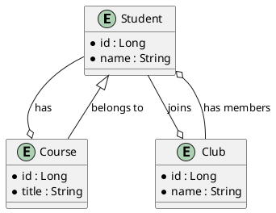

### Step 1: Create a Spring Boot Project - Postgres With DB Mapping (@OneToMany,@ManyToMany,@ManyToOne)
)

You can create a Spring Boot project using Spring Initializr or manually create a Maven project. Below are the steps to set it up manually:

1. **Create a new Maven project**.
2. **Add the necessary dependencies** to the `pom.xml`.

```xml
<dependencies>
    <!-- Spring Boot Starter Web for RESTful APIs -->
    <dependency>
        <groupId>org.springframework.boot</groupId>
        <artifactId>spring-boot-starter-web</artifactId>
    </dependency>

    <!-- Spring Boot Starter Data JPA for working with databases -->
    <dependency>
        <groupId>org.springframework.boot</groupId>
        <artifactId>spring-boot-starter-data-jpa</artifactId>
    </dependency>

    <!-- PostgreSQL Driver -->
    <dependency>
        <groupId>org.postgresql</groupId>
        <artifactId>postgresql</artifactId>
        <scope>runtime</scope>
    </dependency>

    <!-- Spring Boot Starter Test for testing -->
    <dependency>
        <groupId>org.springframework.boot</groupId>
        <artifactId>spring-boot-starter-test</artifactId>
        <scope>test</scope>
    </dependency>

    <!-- Spring Boot DevTools for development -->
    <dependency>
        <groupId>org.springframework.boot</groupId>
        <artifactId>spring-boot-devtools</artifactId>
        <scope>runtime</scope>
        <optional>true</optional>
    </dependency>

    <!-- Spring Boot Starter Validation for input validation -->
    <dependency>
        <groupId>org.springframework.boot</groupId>
        <artifactId>spring-boot-starter-validation</artifactId>
    </dependency>

    <!-- Lombok for reducing boilerplate code -->
    <dependency>
        <groupId>org.projectlombok</groupId>
        <artifactId>lombok</artifactId>
        <optional>true</optional>
    </dependency>

    <!-- Jackson Data-bind for JSON processing -->
    <dependency>
        <groupId>com.fasterxml.jackson.core</groupId>
        <artifactId>jackson-databind</artifactId>
    </dependency>

    <!-- Spring Boot Starter for WebSocket -->
    <dependency>
        <groupId>org.springframework.boot</groupId>
        <artifactId>spring-boot-starter-websocket</artifactId>
    </dependency>

    <!-- Spring Messaging (required for WebSocket) -->
    <dependency>
        <groupId>org.springframework</groupId>
        <artifactId>spring-messaging</artifactId>
    </dependency>
</dependencies>
```

### Step 2: Configure `application.yml`

Create an `application.yml` file in `src/main/resources` with the following content:

```yaml
spring:
  application:
    name: dish-api

  datasource:
    url: jdbc:postgresql://localhost:5432/postgres
    username: postgres
    password: mysecretpassword
    driver-class-name: org.postgresql.Driver
  jpa:
    database-platform: org.hibernate.dialect.PostgreSQLDialect
    hibernate:
      ddl-auto: update

server:
  port: 8081
```

### Step 3: Create Entity Classes with Relationships

1. **Student Entity** (`src/main/java/com/example/demo/model/Student.java`):

```java
package com.example.demo.model;

import lombok.Data;
import javax.persistence.*;
import javax.validation.constraints.NotBlank;
import java.util.List;

@Data
@Entity
@Table(name = "students")
public class Student {
    @Id
    @GeneratedValue(strategy = GenerationType.IDENTITY)
    private Long id;

    @NotBlank(message = "Name is mandatory")
    private String name;

    @OneToMany(mappedBy = "student", cascade = CascadeType.ALL, orphanRemoval = true)
    private List<Course> courses;

    @ManyToMany
    @JoinTable(
      name = "student_club",
      joinColumns = @JoinColumn(name = "student_id"),
      inverseJoinColumns = @JoinColumn(name = "club_id"))
    private List<Club> clubs;
}
```

2. **Course Entity** (`src/main/java/com/example/demo/model/Course.java`):

```java
package com.example.demo.model;

import lombok.Data;
import javax.persistence.*;
import javax.validation.constraints.NotBlank;

@Data
@Entity
@Table(name = "courses")
public class Course {
    @Id
    @GeneratedValue(strategy = GenerationType.IDENTITY)
    private Long id;

    @NotBlank(message = "Title is mandatory")
    private String title;

    @ManyToOne
    @JoinColumn(name = "student_id", nullable = false)
    private Student student;
}
```

3. **Club Entity** (`src/main/java/com/example/demo/model/Club.java`):

```java
package com.example.demo.model;

import lombok.Data;
import javax.persistence.*;
import javax.validation.constraints.NotBlank;
import java.util.List;

@Data
@Entity
@Table(name = "clubs")
public class Club {
    @Id
    @GeneratedValue(strategy = GenerationType.IDENTITY)
    private Long id;

    @NotBlank(message = "Name is mandatory")
    private String name;

    @ManyToMany(mappedBy = "clubs")
    private List<Student> students;
}
```

### Step 4: Create Repositories

1. **StudentRepository** (`src/main/java/com/example/demo/repository/StudentRepository.java`):

```java
package com.example.demo.repository;

import com.example.demo.model.Student;
import org.springframework.data.jpa.repository.JpaRepository;
import org.springframework.stereotype.Repository;

@Repository
public interface StudentRepository extends JpaRepository<Student, Long> {
}
```

2. **CourseRepository** (`src/main/java/com/example/demo/repository/CourseRepository.java`):

```java
package com.example.demo.repository;

import com.example.demo.model.Course;
import org.springframework.data.jpa.repository.JpaRepository;
import org.springframework.stereotype.Repository;

@Repository
public interface CourseRepository extends JpaRepository<Course, Long> {
}
```

3. **ClubRepository** (`src/main/java/com/example/demo/repository/ClubRepository.java`):

```java
package com.example.demo.repository;

import com.example.demo.model.Club;
import org.springframework.data.jpa.repository.JpaRepository;
import org.springframework.stereotype.Repository;

@Repository
public interface ClubRepository extends JpaRepository<Club, Long> {
}
```

### Step 5: Create Services

1. **StudentService** (`src/main/java/com/example/demo/service/StudentService.java`):

```java
package com.example.demo.service;

import com.example.demo.model.Student;
import com.example.demo.repository.StudentRepository;
import org.springframework.beans.factory.annotation.Autowired;
import org.springframework.stereotype.Service;

import java.util.List;

@Service
public class StudentService {
    @Autowired
    private StudentRepository studentRepository;

    public List<Student> getAllStudents() {
        return studentRepository.findAll();
    }

    public Student getStudentById(Long id) {
        return studentRepository.findById(id).orElse(null);
    }

    public Student createStudent(Student student) {
        return studentRepository.save(student);
    }

    public Student updateStudent(Long id, Student studentDetails) {
        Student student = studentRepository.findById(id).orElse(null);
        if (student != null) {
            student.setName(studentDetails.getName());
            student.setCourses(studentDetails.getCourses());
            student.setClubs(studentDetails.getClubs());
            return studentRepository.save(student);
        }
        return null;
    }

    public void deleteStudent(Long id) {
        studentRepository.deleteById(id);
    }
}
```

2. **CourseService** (`src/main/java/com/example/demo/service/CourseService.java`):

```java
package com.example.demo.service;

import com.example.demo.model.Course;
import com.example.demo.repository.CourseRepository;
import org.springframework.beans.factory.annotation.Autowired;
import org.springframework.stereotype.Service;

import java.util.List;

@Service
public class CourseService {
    @Autowired
    private CourseRepository courseRepository;

    public List<Course> getAllCourses() {
        return courseRepository.findAll();
    }

    public Course getCourseById(Long id) {
        return courseRepository.findById(id).orElse(null);
    }

    public Course createCourse(Course course) {
        return courseRepository.save(course);
    }

    public Course updateCourse(Long id, Course courseDetails) {
        Course course = courseRepository.findById(id).orElse(null);
        if (course != null) {
            course.setTitle(courseDetails.getTitle());
            course.setStudent(courseDetails.getStudent());
            return courseRepository.save(course);
        }
        return null;
    }

    public void deleteCourse(Long id) {
        courseRepository.deleteById(id);
    }
}
```

3. **ClubService** (`src/main/java/com/example/demo/service/ClubService.java`):

```java
package com.example.demo.service;

import com.example.demo.model.Club;
import com.example.demo.repository.ClubRepository;
import org.springframework.beans.factory.annotation.Autowired;
import org.springframework.stereotype.Service;

import java.util.List;

@Service
public class ClubService {
    @Autowired
    private ClubRepository clubRepository;

    public List<Club> getAllClubs() {
        return clubRepository.findAll();
    }

    public Club getClubById(Long id) {
        return clubRepository.findById(id).orElse(null);
    }

    public Club createClub(Club club) {
        return clubRepository.save(club);
    }

    public Club updateClub(Long id, Club clubDetails) {
        Club club = clubRepository.findById(id).orElse(null);
        if (club != null) {
            club.setName(clubDetails.getName());
            club.setStudents(clubDetails.getStudents());
            return clubRepository.save(club);
        }
        return null;
    }

    public void deleteClub(Long id) {
        clubRepository

.deleteById(id);
    }
}
```

### Step 6: Create Controllers

1. **StudentController** (`src/main/java/com/example/demo/controller/StudentController.java`):

```java
package com.example.demo.controller;

import com.example.demo.model.Student;
import com.example.demo.service.StudentService;
import org.springframework.beans.factory.annotation.Autowired;
import org.springframework.http.ResponseEntity;
import org.springframework.web.bind.annotation.*;

import javax.validation.Valid;
import java.util.List;

@RestController
@RequestMapping("/api/students")
public class StudentController {

    @Autowired
    private StudentService studentService;

    @GetMapping
    public List<Student> getAllStudents() {
        return studentService.getAllStudents();
    }

    @GetMapping("/{id}")
    public ResponseEntity<Student> getStudentById(@PathVariable(value = "id") Long id) {
        Student student = studentService.getStudentById(id);
        return student != null ? ResponseEntity.ok().body(student) : ResponseEntity.notFound().build();
    }

    @PostMapping
    public Student createStudent(@Valid @RequestBody Student student) {
        return studentService.createStudent(student);
    }

    @PutMapping("/{id}")
    public ResponseEntity<Student> updateStudent(@PathVariable(value = "id") Long id,
                                                 @Valid @RequestBody Student studentDetails) {
        Student updatedStudent = studentService.updateStudent(id, studentDetails);
        return updatedStudent != null ? ResponseEntity.ok().body(updatedStudent) : ResponseEntity.notFound().build();
    }

    @DeleteMapping("/{id}")
    public ResponseEntity<Void> deleteStudent(@PathVariable(value = "id") Long id) {
        studentService.deleteStudent(id);
        return ResponseEntity.ok().build();
    }
}
```

2. **CourseController** (`src/main/java/com/example/demo/controller/CourseController.java`):

```java
package com.example.demo.controller;

import com.example.demo.model.Course;
import com.example.demo.service.CourseService;
import org.springframework.beans.factory.annotation.Autowired;
import org.springframework.http.ResponseEntity;
import org.springframework.web.bind.annotation.*;

import javax.validation.Valid;
import java.util.List;

@RestController
@RequestMapping("/api/courses")
public class CourseController {

    @Autowired
    private CourseService courseService;

    @GetMapping
    public List<Course> getAllCourses() {
        return courseService.getAllCourses();
    }

    @GetMapping("/{id}")
    public ResponseEntity<Course> getCourseById(@PathVariable(value = "id") Long id) {
        Course course = courseService.getCourseById(id);
        return course != null ? ResponseEntity.ok().body(course) : ResponseEntity.notFound().build();
    }

    @PostMapping
    public Course createCourse(@Valid @RequestBody Course course) {
        return courseService.createCourse(course);
    }

    @PutMapping("/{id}")
    public ResponseEntity<Course> updateCourse(@PathVariable(value = "id") Long id,
                                               @Valid @RequestBody Course courseDetails) {
        Course updatedCourse = courseService.updateCourse(id, courseDetails);
        return updatedCourse != null ? ResponseEntity.ok().body(updatedCourse) : ResponseEntity.notFound().build();
    }

    @DeleteMapping("/{id}")
    public ResponseEntity<Void> deleteCourse(@PathVariable(value = "id") Long id) {
        courseService.deleteCourse(id);
        return ResponseEntity.ok().build();
    }
}
```

3. **ClubController** (`src/main/java/com/example/demo/controller/ClubController.java`):

```java
package com.example.demo.controller;

import com.example.demo.model.Club;
import com.example.demo.service.ClubService;
import org.springframework.beans.factory.annotation.Autowired;
import org.springframework.http.ResponseEntity;
import org.springframework.web.bind.annotation.*;

import javax.validation.Valid;
import java.util.List;

@RestController
@RequestMapping("/api/clubs")
public class ClubController {

    @Autowired
    private ClubService clubService;

    @GetMapping
    public List<Club> getAllClubs() {
        return clubService.getAllClubs();
    }

    @GetMapping("/{id}")
    public ResponseEntity<Club> getClubById(@PathVariable(value = "id") Long id) {
        Club club = clubService.getClubById(id);
        return club != null ? ResponseEntity.ok().body(club) : ResponseEntity.notFound().build();
    }

    @PostMapping
    public Club createClub(@Valid @RequestBody Club club) {
        return clubService.createClub(club);
    }

    @PutMapping("/{id}")
    public ResponseEntity<Club> updateClub(@PathVariable(value = "id") Long id,
                                           @Valid @RequestBody Club clubDetails) {
        Club updatedClub = clubService.updateClub(id, clubDetails);
        return updatedClub != null ? ResponseEntity.ok().body(updatedClub) : ResponseEntity.notFound().build();
    }

    @DeleteMapping("/{id}")
    public ResponseEntity<Void> deleteClub(@PathVariable(value = "id") Long id) {
        clubService.deleteClub(id);
        return ResponseEntity.ok().build();
    }
}
```

### Step 7: Build and Run the Project

1. **Clean and build the project** using Maven:

```bash
mvn clean install -DskipTests
```

2. **Run the application**:

```bash
mvn spring-boot:run
```

This setup will give you a fully functional Spring Boot application with CRUD APIs for `Student`, `Course`, and `Club` entities, including one-to-many, many-to-one, and many-to-many relationships.

### Additional Notes:

- **Ensure PostgreSQL is running** and accessible with the credentials provided in `application.yml`.
- **Make sure you have Lombok installed** in your IDE to avoid compilation errors.
- **Add more validation and error handling** as needed in the services and controllers.


Here are the cURL commands for interacting with `CourseController`, `StudentController`, and `ClubController`. I will include the cURL commands for basic CRUD operations and provide commands to create 10 objects for each entity.

### **cURL Commands for `CourseController`**

#### **CRUD Operations**

1. **Create Course**:
    ```sh
    curl -X POST http://localhost:8081/api/courses -H "Content-Type: application/json" -d '{"title": "Mathematics"}'
    ```

2. **Read All Courses**:
    ```sh
    curl -X GET http://localhost:8081/api/courses
    ```

3. **Read Course by ID**:
    ```sh
    curl -X GET http://localhost:8081/api/courses/{id}
    ```

4. **Update Course**:
    ```sh
    curl -X PUT http://localhost:8081/api/courses/{id} -H "Content-Type: application/json" -d '{"title": "Advanced Mathematics"}'
    ```

5. **Delete Course**:
    ```sh
    curl -X DELETE http://localhost:8081/api/courses/{id}
    ```

#### **Create 10 Courses**

```sh
curl -X POST http://localhost:8081/api/courses -H "Content-Type: application/json" -d '{"title": "Mathematics"}'
curl -X POST http://localhost:8081/api/courses -H "Content-Type: application/json" -d '{"title": "Physics"}'
curl -X POST http://localhost:8081/api/courses -H "Content-Type: application/json" -d '{"title": "Chemistry"}'
curl -X POST http://localhost:8081/api/courses -H "Content-Type: application/json" -d '{"title": "Biology"}'
curl -X POST http://localhost:8081/api/courses -H "Content-Type: application/json" -d '{"title": "History"}'
curl -X POST http://localhost:8081/api/courses -H "Content-Type: application/json" -d '{"title": "Geography"}'
curl -X POST http://localhost:8081/api/courses -H "Content-Type: application/json" -d '{"title": "English"}'
curl -X POST http://localhost:8081/api/courses -H "Content-Type: application/json" -d '{"title": "Computer Science"}'
curl -X POST http://localhost:8081/api/courses -H "Content-Type: application/json" -d '{"title": "Art"}'
curl -X POST http://localhost:8081/api/courses -H "Content-Type: application/json" -d '{"title": "Music"}'
```

---

### **cURL Commands for `StudentController`**

#### **CRUD Operations**

1. **Create Student**:
    ```sh
    curl -X POST http://localhost:8081/api/students -H "Content-Type: application/json" -d '{"name": "Alice"}'
    ```

2. **Read All Students**:
    ```sh
    curl -X GET http://localhost:8081/api/students
    ```

3. **Read Student by ID**:
    ```sh
    curl -X GET http://localhost:8081/api/students/{id}
    ```

4. **Update Student**:
    ```sh
    curl -X PUT http://localhost:8081/api/students/{id} -H "Content-Type: application/json" -d '{"name": "Alice Smith"}'
    ```

5. **Delete Student**:
    ```sh
    curl -X DELETE http://localhost:8081/api/students/{id}
    ```

#### **Create 10 Students**

```sh
curl -X POST http://localhost:8081/api/students -H "Content-Type: application/json" -d '{"name": "Alice"}'
curl -X POST http://localhost:8081/api/students -H "Content-Type: application/json" -d '{"name": "Bob"}'
curl -X POST http://localhost:8081/api/students -H "Content-Type: application/json" -d '{"name": "Charlie"}'
curl -X POST http://localhost:8081/api/students -H "Content-Type: application/json" -d '{"name": "David"}'
curl -X POST http://localhost:8081/api/students -H "Content-Type: application/json" -d '{"name": "Eva"}'
curl -X POST http://localhost:8081/api/students -H "Content-Type: application/json" -d '{"name": "Frank"}'
curl -X POST http://localhost:8081/api/students -H "Content-Type: application/json" -d '{"name": "Grace"}'
curl -X POST http://localhost:8081/api/students -H "Content-Type: application/json" -d '{"name": "Hannah"}'
curl -X POST http://localhost:8081/api/students -H "Content-Type: application/json" -d '{"name": "Isaac"}'
curl -X POST http://localhost:8081/api/students -H "Content-Type: application/json" -d '{"name": "Jack"}'
```

---

### **cURL Commands for `ClubController`**

#### **CRUD Operations**

1. **Create Club**:
    ```sh
    curl -X POST http://localhost:8081/api/clubs -H "Content-Type: application/json" -d '{"name": "Science Club"}'
    ```

2. **Read All Clubs**:
    ```sh
    curl -X GET http://localhost:8081/api/clubs
    ```

3. **Read Club by ID**:
    ```sh
    curl -X GET http://localhost:8081/api/clubs/{id}
    ```

4. **Update Club**:
    ```sh
    curl -X PUT http://localhost:8081/api/clubs/{id} -H "Content-Type: application/json" -d '{"name": "Technology Club"}'
    ```

5. **Delete Club**:
    ```sh
    curl -X DELETE http://localhost:8081/api/clubs/{id}
    ```

#### **Create 10 Clubs**

```sh
curl -X POST http://localhost:8081/api/clubs -H "Content-Type: application/json" -d '{"name": "Science Club"}'
curl -X POST http://localhost:8081/api/clubs -H "Content-Type: application/json" -d '{"name": "Art Club"}'
curl -X POST http://localhost:8081/api/clubs -H "Content-Type: application/json" -d '{"name": "Music Club"}'
curl -X POST http://localhost:8081/api/clubs -H "Content-Type: application/json" -d '{"name": "Drama Club"}'
curl -X POST http://localhost:8081/api/clubs -H "Content-Type: application/json" -d '{"name": "Debate Club"}'
curl -X POST http://localhost:8081/api/clubs -H "Content-Type: application/json" -d '{"name": "Chess Club"}'
curl -X POST http://localhost:8081/api/clubs -H "Content-Type: application/json" -d '{"name": "Robotics Club"}'
curl -X POST http://localhost:8081/api/clubs -H "Content-Type: application/json" -d '{"name": "Photography Club"}'
curl -X POST http://localhost:8081/api/clubs -H "Content-Type: application/json" -d '{"name": "Coding Club"}'
curl -X POST http://localhost:8081/api/clubs -H "Content-Type: application/json" -d '{"name": "Environment Club"}'
```

### Usage

- Replace `{id}` in the cURL commands with the actual ID of the resource you want to interact with.
- Ensure your Spring Boot application is running and accessible at `http://localhost:8081` before executing these commands.


Let's create the ERD diagram, Postgres queries, and CRUD operations based on the provided Java classes.

### ERD Diagram in PlantUML

Here’s how you can represent the `Student`, `Course`, and `Club` entities in an ERD using PlantUML:



### Postgres Table Definitions

```sql
-- Create Student table
CREATE TABLE students (
    id SERIAL PRIMARY KEY,
    name VARCHAR(255) NOT NULL
);

-- Create Course table
CREATE TABLE courses (
    id SERIAL PRIMARY KEY,
    title VARCHAR(255) NOT NULL,
    student_id BIGINT NOT NULL,
    FOREIGN KEY (student_id) REFERENCES students(id) ON DELETE CASCADE
);

-- Create Club table
CREATE TABLE clubs (
    id SERIAL PRIMARY KEY,
    name VARCHAR(255) NOT NULL
);

-- Create junction table for many-to-many relationship between students and clubs
CREATE TABLE student_club (
    student_id BIGINT NOT NULL,
    club_id BIGINT NOT NULL,
    PRIMARY KEY (student_id, club_id),
    FOREIGN KEY (student_id) REFERENCES students(id) ON DELETE CASCADE,
    FOREIGN KEY (club_id) REFERENCES clubs(id) ON DELETE CASCADE
);
```

### Insert Queries

```sql
-- Insert Students
INSERT INTO students (name) VALUES ('Alice');
INSERT INTO students (name) VALUES ('Bob');
INSERT INTO students (name) VALUES ('Charlie');
INSERT INTO students (name) VALUES ('David');
INSERT INTO students (name) VALUES ('Eva');
INSERT INTO students (name) VALUES ('Frank');
INSERT INTO students (name) VALUES ('Grace');
INSERT INTO students (name) VALUES ('Hannah');
INSERT INTO students (name) VALUES ('Isaac');
INSERT INTO students (name) VALUES ('Jack');

-- Insert Courses
INSERT INTO courses (title, student_id) VALUES ('Math 101', 1);
INSERT INTO courses (title, student_id) VALUES ('English 101', 2);
INSERT INTO courses (title, student_id) VALUES ('History 101', 3);
INSERT INTO courses (title, student_id) VALUES ('Science 101', 4);
INSERT INTO courses (title, student_id) VALUES ('Biology 101', 5);
INSERT INTO courses (title, student_id) VALUES ('Chemistry 101', 6);
INSERT INTO courses (title, student_id) VALUES ('Physics 101', 7);
INSERT INTO courses (title, student_id) VALUES ('Geography 101', 8);
INSERT INTO courses (title, student_id) VALUES ('Art 101', 9);
INSERT INTO courses (title, student_id) VALUES ('Music 101', 10);

-- Insert Clubs
INSERT INTO clubs (name) VALUES ('Science Club');
INSERT INTO clubs (name) VALUES ('Math Club');
INSERT INTO clubs (name) VALUES ('Art Club');
INSERT INTO clubs (name) VALUES ('Music Club');
INSERT INTO clubs (name) VALUES ('History Club');
INSERT INTO clubs (name) VALUES ('Literature Club');
INSERT INTO clubs (name) VALUES ('Drama Club');
INSERT INTO clubs (name) VALUES ('Debate Club');
INSERT INTO clubs (name) VALUES ('Chess Club');
INSERT INTO clubs (name) VALUES ('Robotics Club');

-- Insert into Student-Club Relationship Table
INSERT INTO student_club (student_id, club_id) VALUES (1, 1);
INSERT INTO student_club (student_id, club_id) VALUES (2, 2);
INSERT INTO student_club (student_id, club_id) VALUES (3, 3);
INSERT INTO student_club (student_id, club_id) VALUES (4, 4);
INSERT INTO student_club (student_id, club_id) VALUES (5, 5);
INSERT INTO student_club (student_id, club_id) VALUES (6, 6);
INSERT INTO student_club (student_id, club_id) VALUES (7, 7);
INSERT INTO student_club (student_id, club_id) VALUES (8, 8);
INSERT INTO student_club (student_id, club_id) VALUES (9, 9);
INSERT INTO student_club (student_id, club_id) VALUES (10, 10);
```

### CRUD Queries

#### Create

```sql
-- Add a new student
INSERT INTO students (name) VALUES ('New Student');

-- Add a new course
INSERT INTO courses (title, student_id) VALUES ('New Course', 1);

-- Add a new club
INSERT INTO clubs (name) VALUES ('New Club');
```

#### Read

```sql
-- Get all students
SELECT * FROM students;

-- Get all courses
SELECT * FROM courses;

-- Get all clubs
SELECT * FROM clubs;

-- Get a student by ID
SELECT * FROM students WHERE id = 1;

-- Get courses for a specific student
SELECT * FROM courses WHERE student_id = 1;

-- Get clubs for a specific student
SELECT c.* FROM clubs c
JOIN student_club sc ON c.id = sc.club_id
WHERE sc.student_id = 1;
```

#### Update

```sql
-- Update a student's name
UPDATE students SET name = 'Updated Name' WHERE id = 1;

-- Update a course's title
UPDATE courses SET title = 'Updated Course Title' WHERE id = 1;

-- Update a club's name
UPDATE clubs SET name = 'Updated Club Name' WHERE id = 1;
```

#### Delete

```sql
-- Delete a student
DELETE FROM students WHERE id = 1;

-- Delete a course
DELETE FROM courses WHERE id = 1;

-- Delete a club
DELETE FROM clubs WHERE id = 1;

-- Delete a student-club relationship
DELETE FROM student_club WHERE student_id = 1 AND club_id = 1;
```

### Join Queries

```sql
-- Get students with their courses
SELECT s.name AS student_name, c.title AS course_title
FROM students s
JOIN courses c ON s.id = c.student_id;

-- Get students with their clubs
SELECT s.name AS student_name, cl.name AS club_name
FROM students s
JOIN student_club sc ON s.id = sc.student_id
JOIN clubs cl ON sc.club_id = cl.id;

-- Get courses with the corresponding student name
SELECT c.title AS course_title, s.name AS student_name
FROM courses c
JOIN students s ON c.student_id = s.id;
```

These SQL queries and cURL commands should help you manage and interact with your `Student`, `Course`, and `Club` entities effectively.